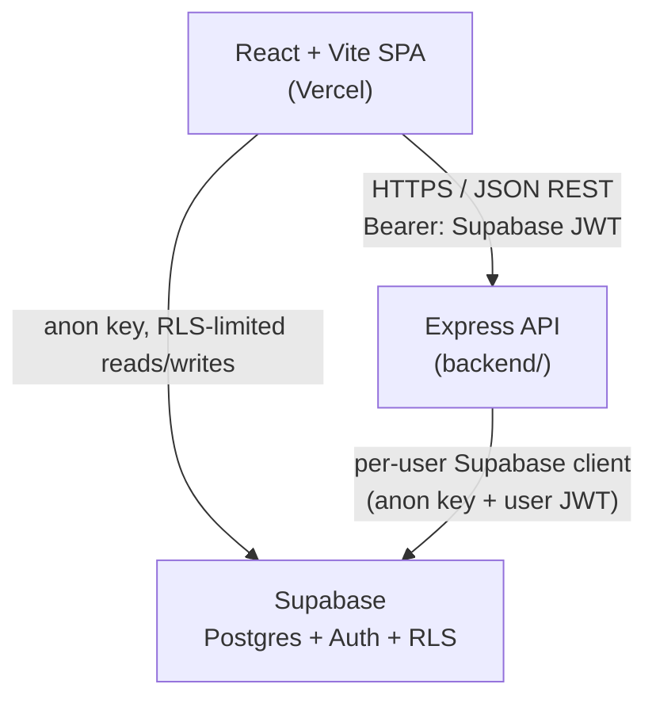

# 🛒 Smart-Cart

Smart-Cart is a full-stack e-commerce platform with a React storefront, a hardened Express REST API, and a Supabase (Postgres) backend where authorization is enforced at the database layer via Row-Level Security — not just in application code. It covers the full customer journey (browsing, cart, wishlist, checkout, orders, returns) alongside a parallel admin console for managing products, orders, customers, coupons, and analytics.

[](https://smart-cart-fastfood.vercel.app/)
[](https://github.com/Vivek1054/Smart-Cart)
[](https://react.dev/)
[](https://vitejs.dev/)
[](https://nodejs.org/)
[](https://expressjs.com/)
[](https://supabase.com/)
[](https://tailwindcss.com/)

---

## 🚀 Live Demo

**Live Application:** **[https://smart-cart-fastfood.vercel.app/](https://smart-cart-fastfood.vercel.app/)**
**Live Backend API:** [https://smart-cart-draw.onrender.com/api/health](https://smart-cart-draw.onrender.com/api/health)

The frontend (`frontend/`) is deployed on **Vercel** as a static Vite build, with `frontend/vercel.json` providing the SPA rewrite rule needed for client-side routing to survive page refreshes and direct navigation.

---

## ✨ Features

### Customer Features
- Product catalog browsing with search, category/price/rating filters, deals, and sorting
- Product detail pages with customer reviews
- Cart and wishlist, persisted server-side per account (with guest-cart merge on login)
- Multi-address checkout with coupon code support
- Order history, order status tracking, reorder, and return requests
- Account management with profile updates and password reset
- Change password from Account → Settings: verifies the current password, then updates it through Supabase Auth
- Password requirements enforced in the UI (8+ characters, upper/lower case, number, special character) with a live strength indicator

### Admin Features
- Dashboard with aggregated metrics and analytics
- Product, category, and inventory management
- Order management with status transitions and detail drill-down
- Customer management (view, block/unblock accounts)
- Review moderation, coupon and promotion management, returns handling, payments overview
- A dedicated, role-gated admin login — accessible only to accounts with `profiles.role = 'admin'`

### Authentication
- Full authentication via **Supabase Auth** (sign up, login, logout, password reset)
- Admins can change their password from the admin Settings page, using the same current-password check
- A database trigger automatically provisions a `public.profiles` row for every new user
- Blocked accounts (`profiles.status = 'Blocked'`) are signed out immediately on login

### Product / Catalog
- Products and categories are served both directly from Supabase (public reads under RLS) and through dedicated catalog endpoints on the Express API
- Review creation/editing is moderated — every new or edited review resets to a `Pending` status

### Cart / Orders
- Cart and wishlist state lives server-side (in Postgres), not just in browser storage
- Checkout is computed entirely inside a single atomic Postgres function (`place_order()`) — prices and totals are never trusted from the client
- Coupon validation runs through a dedicated, rate-limited endpoint backed by a `validate_coupon()` Postgres function

---

## 🧱 Tech Stack

| Layer | Technology |
|---|---|
| **Frontend** | React 19, Vite 6, React Router 7 |
| **Styling** | Tailwind CSS 3, DaisyUI, Framer Motion |
| **Backend** | Node.js (≥18.18), Express 5 |
| **API** | REST (JSON), Zod request validation, Helmet, CORS, express-rate-limit |
| **Database** | Supabase (Postgres), SQL functions/RPCs, Row-Level Security |
| **Authentication** | Supabase Auth |
| **Deployment** | Vercel (frontend), Render (backend API — per project docs), Supabase Cloud (database) |
| **Development Tools** | ESLint 9, Node's built-in test runner (`node --test`), PGlite (in-memory Postgres for RLS tests) |

---

## 🏗️ Architecture



The frontend talks to data in two deliberate ways:
1. **Directly to Supabase** (via `@supabase/supabase-js` and the public anon key) for catalog browsing, auth, and most day-to-day reads/writes — protected entirely by Row-Level Security.
2. **Through the Express API** (`frontend/src/services/api.js`, authenticated with the Supabase access token) for operations needing server-side orchestration: checkout, coupon validation, returns, reviews, and all admin operations.

**Responsibilities by layer:**
- **`frontend/`** — the React/Vite single-page application: customer storefront, admin console, and all UI state/routing.
- **`backend/`** — the Express REST API that verifies caller identity, validates input, and executes business logic through a per-user Supabase client so Row-Level Security always applies, regardless of which layer issued the query.
- **`supabase/`** — the actual source of truth for data and authorization: Postgres schema, RLS policies, and SQL functions (`place_order`, `validate_coupon`, `admin_dashboard`, etc.).

---

## 📁 Project Structure

```
Smart-Cart/
├── frontend/                   # React + Vite single-page app
│   └── src/
│       ├── Pages/              # Customer-facing pages (Home, Menu, Cart, Checkout, Account, ...)
│       ├── admin/
│       │   ├── Pages/          # Admin console pages (Dashboard, Orders, Products, Analytics, ...)
│       │   └── components/     # Admin layout, sidebar, data table, KPI cards, product form
│       ├── Components/         # Shared storefront components (Navbar, CouponInput, NotificationBell, ...)
│       ├── context/            # AuthContext, AdminAuthContext, CartContext, WishlistContext, CatalogContext
│       ├── data/                # Supabase-backed data-access modules (catalog, orders, cart, notifications, ...)
│       ├── services/            # api.js — authenticated client for the Express backend
│       ├── lib/                  # Supabase client setup, error helpers
│       └── ui/                   # Shared UI primitives (Button, Modal, Drawer, Skeleton, charts, ...)
│
├── backend/                     # Express REST API
│   └── src/
│       ├── routes/               # catalog, shopper, admin route definitions
│       ├── services/             # Business logic (cart, order, coupon, payment, review, wishlist, address, admin)
│       ├── middleware/           # auth, admin, validation, rate limiting, error handling
│       ├── config/                # Env validation (Zod), Supabase client factories
│       └── validators/            # Zod request schemas
│
├── supabase/                      # Database layer
│   ├── migrations/                 # Schema, RLS policies & functions, seed data, backend support
│   └── tests/                      # RLS/business-logic tests against an in-memory Postgres (PGlite)
│
└── README.md
```

---

## 🔐 Authentication & Authorization

- **Provider:** Supabase Auth handles sign-up, login, logout, and password reset (`supabase.auth.signUp` / `signInWithPassword` / `signOut` / `resetPasswordForEmail`).
- **Password change:** `frontend/src/services/password.js` verifies the current password with `signInWithPassword`, then calls `updateUser`. Passwords are stored only in Supabase's `auth.users` table as hashes, never in application tables.
- **Session handling:** The Supabase JS client manages and refreshes the session; the frontend's `AuthContext` mirrors that state (`onAuthStateChange`) for UI purposes only.
- **Profiles & roles:** A database trigger (`handle_new_user`) creates a matching `public.profiles` row for every new `auth.users` record, holding `role` and `status`.
- **Role-based access:** `AdminAuthContext` exposes an `isAdmin` flag derived from `profiles.role === 'admin' && status === 'Active'`, used to gate the admin UI (including the `/admin/login` route).
- **Protected routes:** On the backend, `requireAuth` middleware verifies the Supabase JWT on every protected request (`supabase.auth.getUser(token)`) and rejects blocked accounts; `requireAdmin` additionally restricts admin routes to `role = 'admin'`.
- **Real enforcement is in the database:** Every query — whether issued directly by the frontend or proxied through the Express API — runs through a Supabase client scoped to that user's JWT, so Postgres Row-Level Security applies independently of the application layer. As the codebase itself documents: *"Roles are enforced by the database (RLS), not by this UI state."*
- There is no in-app admin signup flow — the first admin is promoted manually via SQL against `public.profiles`.

### Roles & Access Control

SmartCart uses **role-based access control (RBAC)** with two roles, combined with **ownership checks** on user data.

| Role | Who | Access |
|---|---|---|
| `customer` | Any signed-up user (default) | Browse the catalog; manage their own cart, wishlist, addresses, orders, returns, and reviews |
| `admin` | Accounts promoted by a database administrator | Everything a customer can do, plus the admin console and all admin API routes |

Access is enforced in three layers, with the database as the authority:

1. **Database (Row-Level Security):** policies call `is_admin()` and check `auth.uid()` ownership on every table.
2. **Backend:** `requireAuth` verifies the token and loads the role and status from `profiles`; `requireAdmin` restricts `/api/v1/admin/*`.
3. **Frontend:** `AdminAuthContext` and route guards hide admin screens. This is for display only.

Blocked accounts (`status = 'Blocked'`) are rejected at login and by the API.

**Limitations:** there are no granular permissions (for example, "can refund" or "can edit prices" as separate rights), and any admin can currently promote another user to admin. See the roadmap below.

---

## 🔌 API

The backend is an **Express 5** REST API. All business routes are mounted under `/api/v1`; responses follow a single JSON envelope — `{ success, data, meta? }` on success, `{ success: false, error: { code, message, details? } }` on failure. Every request body is validated with **Zod** before it reaches business logic, protected routes pass through the `requireAuth`/`requireAdmin` middleware chain, and uncaught errors are funneled through a single error-handling middleware that never leaks stack traces or internal messages.

<details>
<summary><strong>Health</strong></summary>

| Method | Endpoint | Purpose |
|---|---|---|
| GET | `/api/health` | Liveness probe — no auth, no DB call |
| GET | `/api/ready` | Readiness probe — also checks database connectivity |

</details>

<details>
<summary><strong>Catalog (public)</strong></summary>

| Method | Endpoint | Purpose |
|---|---|---|
| GET | `/api/v1/products` | List/search/filter products (search, category, price range, rating, deals, sort, pagination) |
| GET | `/api/v1/products/:id` | Get a single product |
| GET | `/api/v1/categories` | List categories |
| GET | `/api/v1/products/:productId/reviews` | List approved reviews for a product |
| POST | `/api/v1/products/:productId/reviews` | Create a review *(auth required)* |
| PATCH | `/api/v1/reviews/:id` | Update own review *(auth required — resets status to `Pending`)* |

</details>

<details>
<summary><strong>Shopper (authenticated)</strong></summary>

| Method | Endpoint | Purpose |
|---|---|---|
| GET / POST / PATCH / DELETE | `/api/v1/cart`, `/api/v1/cart/items`, `/api/v1/cart/items/:productId` | Manage server-side cart |
| POST | `/api/v1/cart/merge` | Merge a guest cart into the signed-in account |
| GET / POST / DELETE | `/api/v1/wishlist`, `/api/v1/wishlist/:productId` | Manage wishlist |
| GET | `/api/v1/wishlist/:productId/check` | Check if a product is wishlisted |
| GET / POST / PATCH / DELETE | `/api/v1/addresses`, `/api/v1/addresses/:id` | Manage saved addresses |
| POST | `/api/v1/coupons/validate` | Validate a coupon against cart items (rate-limited) |
| POST | `/api/v1/orders` | Place an order via the `place_order()` RPC (rate-limited) |
| GET | `/api/v1/orders`, `/api/v1/orders/:id`, `/api/v1/orders/:id/status` | List / view orders and status |
| POST | `/api/v1/orders/:id/reorder` | Reorder a previous order |
| POST | `/api/v1/orders/:id/return` | Request a return |
| GET | `/api/v1/returns`, `/api/v1/returns/:id` | View return requests |

</details>

<details>
<summary><strong>Admin (requires <code>role = 'admin'</code>)</strong></summary>

| Method | Endpoint | Purpose |
|---|---|---|
| GET | `/api/v1/admin/dashboard` | Aggregated metrics via `admin_dashboard()` RPC |
| GET / PATCH | `/api/v1/admin/customers`, `.../:id`, `.../:id/status` | Manage customers |
| GET / PATCH | `/api/v1/admin/orders`, `.../:id`, `.../:id/status` | Manage orders |
| GET / POST / PATCH / DELETE | `/api/v1/admin/products`, `.../:id` | Manage products |
| GET / PATCH | `/api/v1/admin/inventory`, `.../:id` | Manage stock levels |
| GET / POST / PATCH / DELETE | `/api/v1/admin/categories`, `.../:id` | Manage categories |
| GET / PATCH | `/api/v1/admin/reviews`, `.../:id` | Moderate reviews |
| GET | `/api/v1/admin/payments` | View payments |
| GET / PATCH | `/api/v1/admin/returns`, `.../:id` | Manage returns |
| GET / POST / PATCH / DELETE | `/api/v1/admin/coupons`, `.../:id` | Manage coupons |

</details>

Full endpoint-level detail and the security rationale behind it also live in [`backend/README.md`](backend/README.md).

---

## 🗄️ Database

- **Technology:** Supabase-managed **Postgres**, with Supabase Auth and Row-Level Security enabled on every table.
- **Migrations:** Four ordered SQL files in [`supabase/migrations/`](supabase/migrations):

  | Migration | Purpose |
  |---|---|
  | `20260929000001_schema.sql` | Core tables and two views (`catalog_products`, `admin_customers`) |
  | `20260929000002_security_and_functions.sql` | RLS policies plus SQL functions: `is_admin()`, `has_purchased()`, `handle_new_user()`, `place_order()`, `validate_coupon()`, `merge_cart()`, `request_return()` |
  | `20260929000003_seed_data.sql` | Idempotent seed data for categories, products, coupons, and site settings |
  | `20260930000004_backend_support.sql` | Review-editing RLS policy and the `admin_dashboard()` aggregation function |

- **Key entities:** `profiles`, `categories`, `products`, `product_reviews`, `cart_items`, `wishlist_items`, `addresses`, `coupons`, `orders`, `order_items`, `order_status_history`, `coupon_redemptions`, `payments`, `returns`, `site_settings`. Orders relate to `order_items` and `order_status_history`; payments relate 1:1 to orders; reviews relate to both `products` and `profiles`.
- **Row-Level Security:** Enabled on every table — public catalog/coupon/settings data is readable by `anon`/`authenticated`, personal data (cart, wishlist, addresses, orders) is owner-only, and admin writes are gated by an `is_admin()` policy check.
- **Seed data:** Present and idempotent — categories, products, coupons, and site settings are seeded; demo customers/orders/payments are intentionally **not** seeded.

---

## ⚙️ Requirements

- **Node.js** ≥ 18.18 (per `backend/package.json` `engines`) and npm
- A **Supabase** project (free tier is sufficient), with the Supabase CLI (`npx supabase`) to apply migrations
- Git

---

## 🛠️ Installation

```bash
git clone https://github.com/Vivek1054/Smart-Cart.git
cd Smart-Cart
```

### 1. Database (Supabase)

```bash
npx supabase login
npx supabase link --project-ref <your-project-ref>
npx supabase db push        # applies all 4 migrations
```
Then, in the Supabase dashboard: disable "Confirm email" for local dev convenience, and set the Site URL / redirect URLs once you know your frontend origin. See [`supabase/README.md`](supabase/README.md) for full detail, including how to promote the first admin user.

### 2. Backend

```bash
cd backend
npm install
cp .env.example .env    # fill in your Supabase project values
npm run dev              # http://localhost:5000
```

### 3. Frontend

```bash
cd frontend
npm install
cp .env.example .env    # fill in Supabase + backend API URL
npm run dev               # http://localhost:5173
```

---

## 🔑 Environment Variables

**`frontend/.env`** (all `VITE_` variables are public/browser-exposed by design):

| Variable | Description |
|---|---|
| `VITE_SUPABASE_URL` | Your Supabase project URL |
| `VITE_SUPABASE_ANON_KEY` | Supabase public/anon key |
| `VITE_API_URL` | Base URL of the Express backend (e.g. `http://localhost:5000`, or the deployed backend URL in production) |

**`backend/.env`**:

| Variable | Description |
|---|---|
| `NODE_ENV` | `development` \| `production` \| `test` |
| `PORT` | Local port (default `5000`); omit in production on platforms that inject their own |
| `SUPABASE_URL` | Supabase project URL |
| `SUPABASE_ANON_KEY` | Supabase public/anon key |
| `SUPABASE_SERVICE_ROLE_KEY` | *Optional.* Backend-only, bypasses RLS. Reserved for a future Razorpay webhook — unused by current routes. **Never** expose this to the frontend. |
| `FRONTEND_URL` | Comma-separated list of allowed CORS origins (e.g. `http://localhost:5173`, or the deployed frontend URL in production) |

> ⚠️ Never commit real `.env` files or secrets. Use the provided `.env.example` files as templates. No real values are included in this README.

---

## 🖥️ Development Commands

| Location | Command | Description |
|---|---|---|
| `frontend/` | `npm run dev` | Start the Vite dev server |
| `frontend/` | `npm run lint` | Run ESLint |
| `backend/` | `npm run dev` | Start the API with auto-reload (`node --watch`) |
| `backend/` | `npm run verify:db` | Sanity-check the connected Supabase database |

## 📦 Build & Production

| Location | Command | Description |
|---|---|---|
| `frontend/` | `npm run build` | Production build (output in `frontend/dist/`) |
| `frontend/` | `npm run preview` | Preview the production build locally |
| `backend/` | `npm start` | Start the API in production mode |

---

## 🚀 Deployment

| Service | Platform | Notes |
|---|---|---|
| Frontend | **Vercel** — live at [smart-cart-fastfood.vercel.app](https://smart-cart-fastfood.vercel.app/) | `frontend/vercel.json` provides the SPA rewrite so client-side routes survive refresh/direct navigation |
| Backend | **Render** — live at [smart-cart-draw.onrender.com](https://smart-cart-draw.onrender.com/api/health) | Root directory `backend`, build `npm install`, start `npm start`, health check path `/api/health` |
| Database | **Supabase Cloud** | Hosted Postgres + Auth + RLS |

Deploy steps (from [`backend/README.md`](backend/README.md)):
1. Push to GitHub.
2. On Render: create a Web Service with root directory `backend`, Node runtime, build command `npm install`, start command `npm start`, health check path `/api/health`.
3. Set backend env vars (`SUPABASE_URL`, `SUPABASE_ANON_KEY`, `FRONTEND_URL` = your Vercel URL, `NODE_ENV=production`). Leave `PORT` and `SUPABASE_SERVICE_ROLE_KEY` unset.
4. Deploy and confirm `GET /api/ready` returns healthy.
5. On Vercel, set `VITE_API_URL` to the Render URL and redeploy the frontend.
6. In Supabase Auth settings, set the Site URL to the Vercel URL and add `<vercel-url>/reset-password` to the allowed redirect URLs.

> Render's free tier cold-starts after inactivity; there is no built-in keep-alive loop in the server, so an external uptime monitor pinging `/api/health` is recommended for production.

---

## 🧪 Testing

| Location | Command | What it covers |
|---|---|---|
| `backend/` | `npm test` | HTTP-layer tests (routing, auth gate, validation, CORS, error envelope, rate limiting) — no database required |
| `backend/` | `npm run test:live` | Full integration tests against a real Supabase project (cart, wishlist, addresses, coupons, checkout, order isolation, privilege-escalation attempts). Requires migrations applied and "Confirm email" disabled. |
| `supabase/tests/` | `npm install && npm test` | 100+ Row-Level Security and business-logic checks run against an in-memory Postgres via PGlite — no live Supabase project needed |

> The frontend currently has no automated test suite (`frontend/package.json` defines no `test` script).

---

## 🩺 Troubleshooting

| Symptom | Likely cause | Fix |
|---|---|---|
| Backend exits immediately on startup | Missing/invalid env vars | Check the console error — it lists exactly which Zod-validated variable is missing, without leaking secrets |
| `GET /api/ready` returns 503 | Supabase migrations not applied, or wrong `SUPABASE_URL`/key | Re-check `supabase db push` ran successfully against the correct project |
| Frontend requests to the API fail with CORS errors | `FRONTEND_URL` on the backend doesn't match the frontend's origin | Update `FRONTEND_URL` in `backend/.env` (comma-separated for multiple origins) |
| Login works but admin pages are inaccessible | Account's `profiles.role` isn't `admin` | Promote the account manually in the Supabase SQL editor (see `supabase/README.md`) |
| Password reset emails link to the wrong domain | Site URL/redirect URLs not configured in Supabase Auth | Set them under Authentication → URL Configuration in the Supabase dashboard |

---

## 🔄 Development Workflow

1. Apply/confirm the latest Supabase migrations against your project.
2. Run the backend (`npm run dev`) and frontend (`npm run dev`) locally against that project.
3. Validate backend changes with `npm test` (fast) and `npm run test:live` (full, against a real project) before relying on them.
4. For schema/RLS changes, add or update the corresponding checks in `supabase/tests/rls.test.mjs` and re-run `npm test` there.
5. Keep secrets out of the frontend — anything prefixed `VITE_` is shipped to the browser.

---

## 🔮 Future Improvements

Based on explicit "not yet implemented" markers in the codebase:

- **Razorpay payment integration** — the `payments` table and service layer already model provider fields (`provider`, `provider_order_id`, `provider_payment_id`), but the actual payment gateway integration (webhook using the service-role key) has not been built yet. COD orders are currently auto-marked `Paid` on delivery; card/UPI orders remain `Pending` until this is implemented.
- **Finer-grained RBAC:** additional roles (such as orders-only staff) with per-permission checks, and restricting admin promotion to a designated super-admin. Both would be enforced in the database policies.
- **Audit log** for role, status, and order changes.
- Automated frontend test coverage.
- CI/CD automation (no GitHub Actions workflows currently exist in this repository).
- **Email-code (OTP) password change:** the Account and admin Settings pages show an OTP option, but it is not complete. Supabase checks the emailed code only if the session is older than 24 hours, so a recent login can change the password without it. A proper verify-then-update flow needs custom SMTP and a template that includes the code. Until then, use the current-password method.
- **Custom SMTP:** reset and verification emails use Supabase's default sender, which has low rate limits. Configure custom SMTP before launching to real customers.

---

## 📄 License

This project is licensed under the [MIT License](LICENSE).

## 👤 Author

**Vivek** — [GitHub](https://github.com/Vivek1054)
